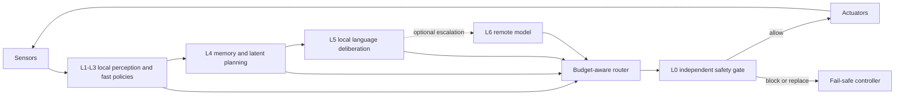

# ShardJEPA and the Case for Multi-Rate, Resource-Bounded Embodied Agents

**Author:** Sylvain Galliez
**ORCID:** [https://orcid.org/0009-0009-1286-3683](https://orcid.org/0009-0009-1286-3683)
**Version:** 2026.08.01
**Status:** Repository preprint; not peer reviewed; no DOI
**License:** CC BY 4.0

**French companion:** [`paper-fr.md`](paper-fr.md)

## Abstract

Resource-bounded embodied agents should not assign perception, control,
safety, memory, planning, and language interaction to one monolithic language
model. We argue instead for a multi-rate architecture in which the least costly
competent component handles each decision under explicit latency, energy,
memory, connectivity, and risk budgets. Small neural evaluators, bounded
retrieval, latent world models, and compact language models may all contribute,
but no unverified generative component directly owns the actuator boundary.
An independent run-time assurance layer checks proposed actions before the
environment can change. This position is narrower than claiming that language
models cannot run on devices or control robots: compact on-device models,
memory-aware inference, and vision-language-action systems already provide
counterexamples. The scientific claim is architectural and falsifiable: under
equal task-success and safety constraints, budget-aware multi-rate routing
should improve the latency-energy-memory Pareto frontier relative to always
invoking the largest available model. ShardJEPA currently implements several
enabling contracts, but it does not yet implement the complete embodied stack.
Its standalone Pattern Lab now adds two genuinely trained task-local experts;
they strengthen the small-component case without validating an embodied router.

## 1. Central thesis

The strongest defensible version of the initial reflection is:

> A resource-bounded embodied agent should use a language model as an optional,
> non-authoritative deliberation component. Fast control, action validation,
> bounded memory, and failure recovery should remain local, explicitly
> budgeted, and independently testable.

This is not the claim that language models have no future in autonomous agents.
It is the claim that they should not be the only computational substrate or the
sole authority over physical action.

The distinction matters. MobileLLM demonstrates useful sub-billion-parameter
language models for on-device tasks [2]. Memory-aware techniques can execute
models larger than available DRAM by selectively loading weights from flash
[3]. Selective state-space models challenge the claim that every useful
sequence model must pay full quadratic attention cost [4]. SayCan grounds
language-model plans in learned affordances [6], while RT-2 directly studies
vision-language-action transfer to robotic control [7]. These systems refute
universal statements such as “a language model cannot run locally,” “cannot
participate in physical action,” or “must contain 10–70 billion parameters.”

They do not remove the architectural problem: an embodied system still needs
deadlines, bounded failure behavior, state estimation, action feasibility,
resource accounting, and a safety case.

## 2. Corrections to the initial claims

| Initial formulation | Publication-ready correction |
|---|---|
| Current LLMs require 10–70B parameters | Many frontier models are large, but sub-billion on-device language models exist. Model size is a design variable, not a universal lower bound. |
| Attention is always quadratic | Full self-attention has quadratic sequence interaction, but sliding-window, recurrent, sparse, and state-space alternatives change the cost profile. |
| An embedded local tier has zero hallucination | Narrow deterministic components reduce exposure to generative errors; they do not guarantee semantic correctness. |
| A deterministic model guarantees physical safety | Repeatability and bounded timing are useful, but safety requires correct specifications, monitoring, fallback behavior, and system-level assurance. |
| k-NN has zero training and adapts instantly | Exact k-NN is fit-free and supports insertion, but query latency and memory grow with the retained dataset; labels and embeddings may still be wrong. |
| Micro-networks replace 80% of decisions | This is a testable routing hypothesis. No ShardJEPA experiment currently establishes the percentage. |
| Mobile agents must remain below 1–3 W or 1–4 GB | Resource envelopes vary by device. Every experiment must state its measured hardware profile instead of using one universal threshold. |
| A language model cannot react below 10 ms | Large autoregressive models are usually poor inner-loop controllers, but latency depends on model, hardware, runtime, prompt, and output length. The architecture should enforce deadlines rather than assume a universal latency. |
| Multi-scale neural architecture is the only viable solution | It is one credible design hypothesis among hybrid control, behavior-based, end-to-end VLA, classical planning, and other architectures. It must win controlled comparisons. |

The original phrase “GEPA” meant “Generalized Embedded Perception
Architecture.” That name is not used as a ShardJEPA module and now collides with
GEPA, a published Genetic-Pareto reflective prompt optimizer [9]. This paper
therefore uses **Local Perception and Action Plane (LPAP)**. GEPA may remain an
internal historical label, but it should not be presented as an established
external architecture without a separate definition and prior-art review.

## 3. Resource and timing model

An embodied deployment should begin with a measured resource profile rather
than a model choice:

\[
\mathcal{B} = (M_{max}, P_{avg}, E_{mission}, D_{control}, D_{task}, C_{net}),
\]

where \(M_{max}\) is peak usable memory, \(P_{avg}\) average power budget,
\(E_{mission}\) mission energy, \(D_{control}\) the control-loop deadline,
\(D_{task}\) the deliberative deadline, and \(C_{net}\) the available
connectivity contract. These values belong to a device and mission profile;
they are not universal constants.

For a candidate module \(j\) and request \(x\), estimate latency \(L_j(x)\),
energy \(E_j(x)\), peak memory \(M_j(x)\), risk bound \(R_j(x)\), and expected
task utility \(Q_j(x)\). The feasible set is

\[
\mathcal{F}(x)=\{j\mid L_j(x)\le D(x),\ E_j(x)\le B_E(x),\
M_j(x)\le B_M(x),\ R_j(x)\le \rho(x)\}.
\]

A budget-aware router may choose

\[
j^*=\arg\max_{j\in\mathcal{F}(x)}
\left(Q_j(x)-\lambda_L L_j(x)-\lambda_E E_j(x)-\lambda_M M_j(x)\right).
\]

If \(\mathcal{F}(x)\) is empty, the correct outcome is a defined fail-safe or
degraded mode—not an unbounded escalation loop.

## 4. Proposed multi-rate architecture

The levels below describe responsibility and cadence, not fixed neural model
sizes. Concrete deadlines must be measured on target hardware.

| Level | Responsibility | Candidate mechanisms | Authority |
|---|---|---|---|
| L0 | Run-time assurance and fail-safe control | verified guards, classical controllers, monitors, emergency stop | may block or replace every proposed action |
| L1 | Signal conditioning and reflex-like responses | filters, thresholds, compact state machines, proposed nano-policies | local and strictly bounded |
| L2 | Fast learned scoring | ShardJEPA micro-MLP, tiny CNN/RNN/SSM, anomaly classifiers | proposes scores or bounded actions |
| L3 | Local perception and action plane | sensor fusion, feature extraction, capability routing, LPAP adapters | local proposal generation |
| L4 | Episodic memory and latent planning | exact or indexed k-NN, ShardJEPA latent prediction, bounded beam search | proposes plans under an explicit budget |
| L5 | Compact local language deliberation | on-device language model, structured planner, dialogue interface | advisory; no direct actuator mutation |
| L6 | Optional remote deliberation | cloud language or multimodal model | advisory and connectivity-dependent |

The architecture does not require every deployment to contain every level. A
small robot may omit language models entirely. A dialogue-centric mobile agent
may use L5 frequently while retaining a separate L0 boundary.

## 5. Safety invariant

Let policy or planner \(\pi\) propose \(\hat{a}_t\) from observation \(o_t\).
The environment may change only after an independent gate evaluates privileged
state \(s_t\):

\[
\hat{a}_t = \pi(o_t), \qquad
a_t = \operatorname{Gate}(s_t,o_t,\hat{a}_t).
\]

If the result is `Block`, no environment mutation occurs. This ordering is
already an executable ShardJEPA Planning Lab contract. It resembles run-time
assurance patterns that combine learning-enabled components with independent
monitors and high-assurance fallbacks [8].

The gate is not automatically correct merely because it is separate. A safety
claim additionally requires a valid hazard model, adequate state visibility,
verified gate behavior, bounded execution time, tested fallback transitions,
and evidence for the operational domain.

## 6. Small networks and bounded retrieval

### 6.1 Micro-network

ShardJEPA's implemented `MicroNnEvaluator` is a deterministic two-layer MLP:

\[
u(x)=w_o^T\operatorname{ReLU}(W_ix+b_i)+b_o.
\]

For input dimension \(d\) and hidden width \(h\), its parameter count is

\[
N_p=dh+2h+1.
\]

The original “10–200 parameters” range is therefore not a definition. A
2-by-8 fixture has 33 parameters, while a 128-by-32 fixture has 4,161
parameters. More importantly, deterministic seeded weights are a software
fixture, not a trained accuracy result.

### 6.2 Nano-network

ShardJEPA has no implemented `NanoNn` contract. The term should mean a
deployment-specific model class only after defining input schema, parameter
budget, numerical format, training procedure, calibration, and worst-case
execution time. Safety-critical thresholds should not be rebranded as neural
networks when a transparent rule is sufficient.

### 6.3 External nano-network prototypes

Two author-associated Hugging Face repositories make the proposed size range
more concrete without constituting ShardJEPA results [10,11]. At the audited
snapshots, CogniARC publishes a 6-to-12-to-4 domain classifier with 136
parameters and an 8-to-16-to-1 action-success predictor with 161 parameters.
Botte publishes six JSON feed-forward models ranging from 50 to 310 parameters.
Both repositories demonstrate the same deployment pattern: train or serialize
outside the runtime, then perform deterministic row-major feed-forward
inference in Rust.

The evidence is preliminary. Replaying the published CogniARC weights and data
generator reproduced 388/500 correct action-success predictions (77.6%) and
3/4 canonical domain examples. The same replay obtained 55/100 on the published
synthetic domain holdout, not the 75% stated by the model card. Botte's ten Rust
unit tests pass, but its audited snapshot contains neither the training script
named by the card nor a dataset and held-out accuracy report. The advertised
5-microsecond latency and 60--90% token savings are therefore hypotheses until
the hardware, compiler, warm-up, repetitions, routing workload, and raw samples
are archived. The complete snapshot audit is recorded in
[`nano-nn-huggingface-audit.md`](../../artifacts/2026-07-29/nano-nn-huggingface-audit.md).

These artifacts justify testing a nano-network routing tier; they do not yet
show that such a tier improves end-to-end task success, energy, latency, or
safety in ShardJEPA.

### 6.4 Task-local learned experts in ShardJEPA

The standalone Pattern Lab now provides two real Rust-only training paths. P0
is a 217-parameter local Soroban-transition verifier. Across seeds 7, 17, and
29 it reached 100% on both its 384-example holdout and a 384-example split using
longer 4–6 digit carrier states, while shuffled-label controls stayed near 50%.
Because every carrier length is projected into the same seven local features,
this is a local invariance result, not learned carry/borrow or multicolumn
arithmetic.

P1 is a separate 961-parameter Elman RNN trained with full backpropagation
through time over explicit multicolumn traces. Training propagation stops at
length 3; the OOD split contains only lengths 4–7. The three seeds reached
77.08–77.92% on interpolation and 68.23–73.96% on OOD, compared with 50% for
the no-propagation OOD baseline and 100% for the exact oracle. This is modest
task-local learned generalization. It is not a routing-policy result, and the
exact oracle remains authoritative. Full evidence appears in `TR-2026-002` and
the [2026-08-01 validation record](../../artifacts/2026-08-01/current-validation.md).

### 6.5 k-NN memory

`ExactPatternMemory` supports validated insertion and exact Euclidean retrieval
for small datasets. With \(N\) entries of dimension \(d\), its current query
computes all distances and sorts all candidates, giving approximately
\(O(Nd+N\log N)\) time and \(O(N)\) query output workspace. It is explainable
at the neighbor level, but it is neither constant-time nor a semantic episodic
memory by itself. Memory admission, eviction, embedding versioning, label
quality, and approximate indexing remain separate design problems.

## 7. What ShardJEPA implements today

| Capability from the thesis | Current repository evidence | Status |
|---|---|---|
| deterministic small neural evaluator | `MicroNnEvaluator` and `MicroNnStateEvaluator` | implemented research fixture |
| associative retrieval | `ExactPatternMemory` exact Euclidean k-NN | implemented for small in-memory datasets |
| latent prediction and ranking | predictors, Poincare/Lorentz spaces, exact and experimental speculative reasoners | implemented prototype |
| compact latent storage | symmetric INT8/INT4 quantization and read-only mmap bytes | implemented with documented limits |
| short-horizon planning | bounded deterministic planning lab and typed budgets | implemented fixture |
| action safety boundary | privileged `SafetyGate`, pre-mutation decision, episode traces, replay | implemented fixture |
| partial observation and communication faults | reliable, delayed, and dropped-message deterministic matrix | implemented fixture |
| nano-network | related external CogniARC/Botte prototypes; no canonical ShardJEPA type or integration | external evidence only |
| task-local learned expert | Pattern Lab P0 MLP and P1 recurrent Soroban verifiers | trained synthetic-task evidence; exact oracle retained |
| LPAP/GEPA sensor plane | no sensor drivers or fusion contract | not implemented |
| hard real-time scheduler | no worst-case execution-time or deadline scheduler | not implemented |
| local or cloud LLM router | runtime deliberately contains no LLM client or orchestration | not implemented |
| physical actuator integration | no simulator or physical backend in the low-level runtime | not implemented |
| energy-aware routing | no on-device power measurement or energy budget | not implemented |

This boundary is intentional. Sensor, simulator, network, and actuator adapters
should remain outside the low-level `src/` runtime and connect through generic
ports. The Planning Lab is the appropriate place for the first deterministic
routing experiments.

## 8. Falsifiable hypotheses

The position paper becomes scientific only when compared against alternatives.

- **H1 — Resource Pareto improvement:** at matched task success and safety,
  budget-aware multi-rate routing reduces energy, p95 latency, peak memory, or
  cloud invocation rate relative to always-local-LLM and always-cloud-LLM
  baselines.
- **H2 — Deadline containment:** inner-loop deadline misses remain below a
  predefined threshold even when higher layers stall or connectivity fails.
- **H3 — Safe degradation:** invalid proposals and resource exhaustion lead to
  bounded block/fallback outcomes without environment mutation.
- **H4 — Incremental memory value:** bounded retrieval improves recovery or
  task success on repeated situations without unacceptable latency growth or
  stale-pattern regressions.

The thesis is weakened or rejected if routing overhead erases the resource
benefit, if task success falls materially at equal safety, if high-level
failures leak through the assurance boundary, or if a simpler monolithic or
classical baseline dominates the measured Pareto frontier.

## 9. Evaluation protocol

Compare at least four architectures under the same observations, actions, and
task budgets:

1. deterministic controller and planner only;
2. compact local language model invoked for every task;
3. remote language model invoked for every task when connected;
4. proposed budget-aware multi-rate router.

For the learned-routing ablation, also compare a transparent rule against the
smallest CogniARC/Botte-compatible feed-forward model that shares the same input
schema. Freeze weights and splits before evaluation; report calibration and
abstention behavior in addition to accuracy.

Evaluate deterministic and multi-seed scenarios with sensor noise,
out-of-distribution layouts, delayed/stale/dropped messages, resource pressure,
and intermittent connectivity. Report:

- task success and reward distribution;
- safety violations, blocked actions, and fallback success;
- p50/p95/p99 latency and deadline-miss ratio per level;
- average power, mission energy, and energy per successful task;
- peak resident memory and retained-memory size;
- calibration or confidence error for learned routers;
- cloud invocation rate and network bytes;
- recovery time after sensor, model, or transport failure.

All power and latency claims must name the target device, runtime, model,
quantization, prompt or input shape, output length, warm-up policy, and sampling
method. Values such as “under 1 ms” or “under 3 W” are experimental outcomes,
not architectural axioms.

## 10. Development roadmap

### P0 — Standalone deterministic substitute

- Add a `ResourceBudget` and per-module capability declaration to the Planning
  Lab, not the low-level runtime.
- Implement a deterministic router over rule, micro-NN, exact-memory, and
  planner fixtures.
- Import one audited nano-network fixture behind a typed adapter, reproduce its
  published inference and accuracy checks, and keep it non-authoritative.
- Keep `SafetyGate` privileged and pre-mutation.
- Add sensor-noise, deadline-miss, energy-token, and connectivity schedules to
  replayable traces.
- Compare against static routing and always-largest-module baselines.

### P1 — Measured edge adapter

- Add one external sensor/actuator adapter with a deterministic simulator
  fallback.
- Measure wall time, peak memory, and device energy using target-specific
  instrumentation.
- Train and calibrate the micro-NN router from fixed train scenarios; evaluate
  on held-out seeds and layouts.
- Add bounded admission and eviction to episodic memory.

### P2 — Language deliberation

- Integrate one compact local language model behind a timeout and typed
  proposal contract.
- Add optional remote escalation with explicit consent, privacy, and
  connectivity policy.
- Prevent both language tiers from bypassing the safety boundary.
- Evaluate whether distillation into smaller policies improves the measured
  Pareto frontier rather than assuming it will.

## 11. Limitations

This paper is a position and experimental specification, not a validation of a
complete mobile agent. ShardJEPA's current embodied evidence uses deterministic
fixtures and scripted policies. It has no physical sensor stream, motor plant,
hard real-time operating system, trained routing policy, on-device language
model, or energy measurement. The proposed decomposition may introduce
interface errors, stale state, routing instability, and verification burden.
The trained Pattern Lab experts evaluate synthetic Soroban traces; they do not
establish routing quality, cross-domain transfer, or embodied task success.
The external nano-network artifacts are not integrated ShardJEPA modules and
their model-card latency or token-saving claims are not system-level validation.
End-to-end vision-language-action models are a serious competing architecture,
not a straw man. The correct outcome must be decided by controlled system-level
evidence.

## 12. Conclusion

The initial reflection was directionally useful but too absolute. Language
models are not inherently cloud-only, universally huge, or categorically
incapable of embodied action. Conversely, their growing capability does not
eliminate the need for bounded control, independent safety, local recovery, and
resource-aware scheduling.

ShardJEPA's defensible thesis is therefore not “LLMs are not the future.” It is:

> The future embodied agent is likely heterogeneous. Language models may
> deliberate, but explicit budgets decide when they run, and an independently
> assured local boundary decides what may physically happen.

## References

1. Yann LeCun. *A Path Towards Autonomous Machine Intelligence*, 2022.
2. Zechun Liu et al. *MobileLLM: Optimizing Sub-billion Parameter Language
   Models for On-Device Use Cases*. ICML 2024.
3. Keivan Alizadeh et al. *LLM in a Flash: Efficient Large Language Model
   Inference with Limited Memory*. ACL 2024.
4. Albert Gu and Tri Dao. *Mamba: Linear-Time Sequence Modeling with Selective
   State Spaces*, 2023.
5. Ji Lin et al. *MCUNet: Tiny Deep Learning on IoT Devices*. NeurIPS 2020.
6. Michael Ahn et al. *Do As I Can, Not As I Say: Grounding Language in Robotic
   Affordances*, 2022.
7. Anthony Brohan et al. *RT-2: Vision-Language-Action Models Transfer Web
   Knowledge to Robotic Control*, 2023.
8. Darren D. Cofer et al. *Run-Time Assurance for Learning-Enabled Systems*.
   NASA Formal Methods 2020.
9. Lakshya A. Agrawal et al. *GEPA: Reflective Prompt Evolution Can Outperform
   Reinforcement Learning*, 2025.
10. Zedgamer. *CogniARC Nano-NN -- Micro Neural Networks for ARC-AGI-3*.
    Hugging Face model repository, snapshot `775c27f`, 2026.
11. Zedgamer. *botte-nano-nn -- Micro Neural Networks for Agent Pipelines*.
    Hugging Face model repository, snapshot `2a1faa9`, 2026.
